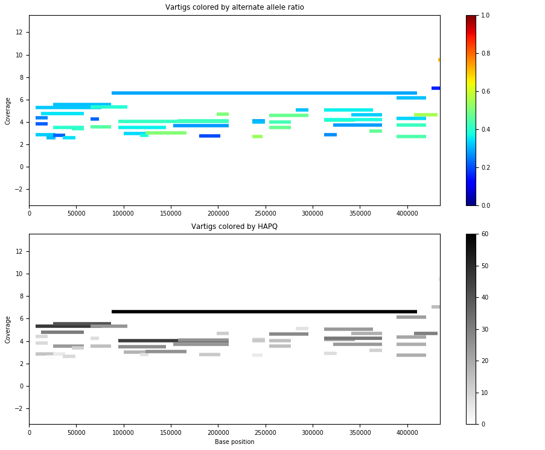
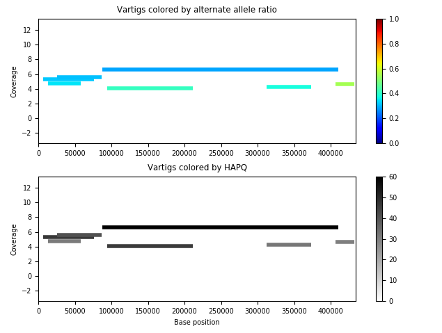

Guide: understanding output phasings and their pitfalls
=======================================

This guide gives a deeper explanation for how to interpret the phasings output by floria and common pitfalls. 

It would be beneficial to do :doc:`../tutorials/tut1` before reading this guide. 

TLDR
-----

Given a contig_ploidy_info.txt found in your floria output directory:

.. code-block:: sh

    cat floria_out_dir/contig_ploidy_info.tsv
    -------------------------------------------
    contig	average_global_straincount	whole_contig_multiplicity	approximate_coverage_ignoring_indels ...
    ...

#. ``average_global_straincount`` tells how many strains there are IF ``whole_contig_multiplicity`` is relatively high. Otherwise, phasing may be spurious of copy number variations.
#. The higher ``approximate_coverage_ignoring_indels`` the better (down to 10 is possible, ideally > 50)
#. The higher ``..._min15/30/45hapq`` is, the better your phasing is. 

How many strains are there in my contig?
---------------------------------------

This is the question that the ``contig_ploidy_info.tsv`` file is trying to answer. A reference for this file can be found at :ref:`contig_ploidy_info`.

Based on our experience, the ``average_global_straincount`` metric and the ``whole_contig_multiplicity`` metrics offers a good indication of the number of strains present. 

Essentially, ``average_global_straincount`` tells you how many times a SNP is covered by vartigs on average. ``whole_contig_multiplicity`` tells you how many vartigs cover your contig. It is important you use both pieces of information. 

**For long reads**: The ``average_global_straincount`` gives a pretty good indication of how many strains there are, and the ``whole_contig_multiplicity`` tends to be very similar to ``average_global_straincount`` **IF** strains are actually present. 

However, it can be the case that ``average_global_straincount`` >> ``whole_contig_multiplicity``, which indicates that only part of the genome is being phased, in which case it is likely that only part of the genome has variation -- perhaps from a very distant, conserved sequence or a mobile element. 

**For short reads**: The ``average_global_straincount`` gives a pretty good indication of how many strains there are, but it may underestimate the number of strains slightly due to short-reads being able to resolve less strains. 

The ``whole_contig_multiplicity`` tends to be much less than ``average_global_straincount`` -- this lies in short-read vartigs covering less of the entire contig. We recommend making sure that ``whole_contig_multiplicity`` is high enough, say > 0.1 at least. 

Spurious variants cause high "strain count"
-----------------------------------

Consider the following "null" test. We generated synthetic reads for a single K. Pneumoniae genome, **so there is no strain heterogeneity**, aligned and called variants using freebayes (with no filters), and ran floria. 

.. code-block:: sh

    cat floria_out_dir/contig_ploidy_info.tsv
    -------------------------------------------
    contig	average_global_straincount	whole_contig_multiplicity	approximate_coverage_ignoring_indels ...
    NZ_CP081897.1	1.754	0.015	15.251	...

The global strain count is still > 1 here, but notice that ``whole_contig_multiplicity`` is very small. 

The global strain count is computed by checking how many times each SNP is covered by vartigs. However, there are almost no variants in the vcf file, because there is only 1 strain (only about 1000 "variants", which are really miscalls, for 5 Mb genome). floria phases the sections with "variation", and within these sections, the strain count is about 2.

However, if we look at ``whole_contig_multiplicity``, we see only 0.015 of the contig is covered by vartigs. This indicates the vartigs are very sparse, so not much phasing is being done. 

**Conclusion:** Be careful on blindly relying on ``average_global_straincount``. Looking at ``whole_contig_multiplicity`` in conjunction gives a better understanding of what is going on. 

Species cross mappings cause high "ploidy" 
-------------------------------------

Suppose we had both E. coli and K. pneumoniae in our community. Because E. coli and K. pneumoniae are not too distant (about 78% ANI), reads from E. coli can map to K. pneumoniae, which we call "cross mapping" here. 

To simulate cross mapping, we can simulate E. coli reads and K. pneumoniae reads, map them to K. pneumoniae (which share about 78% ANI). Now let's see how phasing works:

.. code-block:: sh

    cat cross_map_example/contig_ploidy_info.tsv
    -------------------------------------------
    contig	average_global_straincount	whole_contig_multiplicity	approximate_coverage_ignoring_indels ...
    NZ_CP081897.1	1.774	0.171	18.393	...

As we can see, the strain count is still about 2, since there are two species present. However, the contig multiplicity is again quite small, indicating that many of the reads do not map and hence much of the contig does not get phased. However, still almost 1 MB of vartigs are present. 

**Conclusion:** Be careful of cross mappings. It's best to use a **diverse and dereplicated** set of reference genomes when you are mapping your reads onto reference genomes. 

Short reads give smaller contig multiplicity
-----------------------------------------

We ran floria with short reads on a 3 strain simulated K. pneumoniae community. Here are the results:

.. code-block:: sh

    cat short_three_kpneumoniae_strains/contig_ploidy_info.tsv
    ----------------------------------------------------------
    contig	average_global_straincount	whole_contig_multiplicity	approximate_coverage_ignoring_indels...
    NZ_CP081897.1	2.808	1.677	105.219	...

Notice that the contig multiplicity is quite a bit smaller than 3, the true number of strains. This is because short-reads can not span long enough gaps, so some gaps are left unfilled and have no vartigs covering them. 

On the other hand, for **long reads** on the same community, no such issues occurs.:

.. code-block:: sh

    cat long_three_kpneumoniae_strains/contig_ploidy_info.tsv
    ----------------------------------------------------------
    contig	average_global_straincount	whole_contig_multiplicity	approximate_coverage_ignoring_indels ...
    NZ_CP081897.1	2.985	2.917	96.077	...

Now, on a **real community**, we got the following **short-read** results

.. code-block:: sh

    contig	average_global_straincount   whole_contig_multiplicity ...
    NC_021016.1	2.106	0.806   ...
    NZ_AP024085.1	2.092	0.416   ...	

We found that there were at least 2 strains present in each of these two contigs, but the multiplicity was even less than 1. This is because the strains are more similar to each other. When the strains are more similar, much of the contig can't be phased. 

**Conclusion:** the contig multplicity is helpful, but be aware of its nuances, especially when using short reads. For long-reads, the dispcrepancy between ploidy and multiplicity is less. 

Number of strains is more accurate when the coverage is higher
------------------------------------------------------------

We recommend using floria when there is at least 5x coverage. With noisier reads, you need higher coverages. Consider the following example, with ~95% identity nanopore reads.

.. code-block:: sh

    contig	average_global_straincount   whole_contig_multiplicity ...
    contig_14956	4.072	4.036	

The ploidy and contig multiplicity is around 4, which looks promising. However, the coverage is 14.152, meaning that there each strain has quite slow coverage, which is very small. If we visualize the vartigs from this contig, we get the below picture. 

The strain behavior isn't obvious. The vartigs are so low coverage that they're maybe spurious as well. If we remove vartigs with HAPQ < 30, we get:

which seems to indicate a less number of good vartigs.

**Conclusion**: floria can still phase lower coverage strains around 5x cov, but more care has to be taken. Consider the average_global_straincount_min15/30/45hapq fields. 

and remember, visualization is important! 
--------------------------
