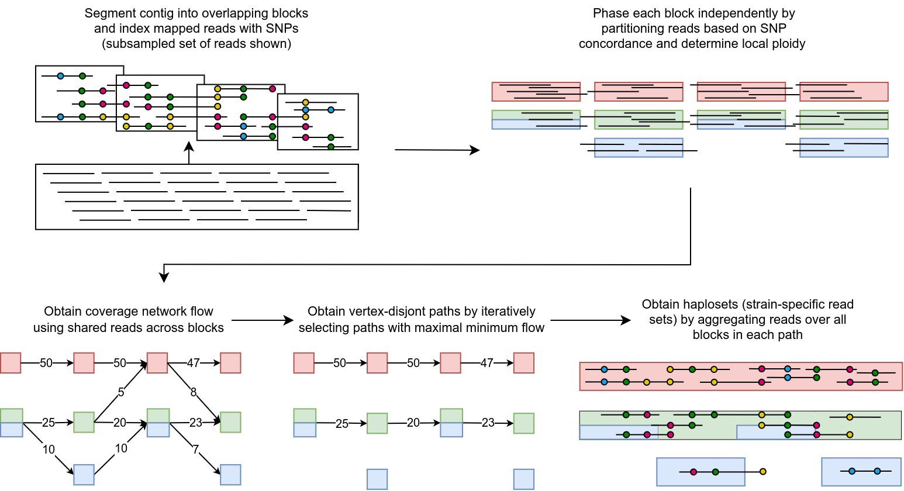

Introduction
=================

This document provides a fundamental understanding of floria's operation and the issue it addresses.

What is floria?
--------------

In microbial communities, strain-level genomic heteogeneity is often present. For example, not all E. coli in a human gut may have the exact same genome; slight variations are common.

When we have two distinct E. coli populations, our community contains two strains. The term strain is somewhat ambiguous, but we will consider a strain to be the genome of a clonal population, all having "similar" genomes. During community sequencing, the reads may originate from either of the two different E. coli strains.

The problem  
----------

To reconstruct the genomes in a metagenomic sample, metagenomic assembly is carried out with software like MEGAHIT or metaflye. However, when heterogeneity is present, assemblies may become a composite of different strains and fail to represent an individual strain accurately.

One could map the reads and call variants to comprehend the variation within the sample. However, variant calling only provides a set of variants without any linkage information, i.e., we cannot ascertain which alleles exist physically on the same chromosome. This is the classic **haplotype phasing problem**.

The solution: phasing
^^^^^^^^^^^^^^^^^^^^^^

floria addresses this problem by **phasing** the reads in a metagenomic community. In this context, it means that floria **groups/clusters reads** in such a way that every group corresponds to exactly one strain. This information can then be utilized downstream for various purposes. For instance:

#. floria's output groups can be assembled, providing strain-level contigs instead of a mosaic contig.
#. We can bypass assembly and examine the variation across the groups of reads. This offers insights into the sequence of SNPs physically present on one strain, for example.

Overview of floria's algorithm
------------------------------

The above diagram outlines floria's main steps. floria requires at minimum

#.  A BAM file with reads mapped a set of contigs that we will try to phase.
#.  A VCF file with SNP information (other variants will be ignored).
#.  The fasta files for the contigs in the BAM file.

Given the above information, floria first uses SNP information in the VCF to annotate the reads in the BAM. floria then groups the reads into overlapping blocks along the contig and phases each of the blocks. We group together these blocks using graph algorithms with network flows to form our final **haplosets**, which we define to be groups of reads coming from the indistinguishable haplotypes. 

The final output from floria is a collection of haplosets. We also provide SNP information along the haplosets (i.e. what are the likely SNPs for the strain represented by the haploset?), as well as visualization and QC information. 

What floria can and can not do
-----------------------------

What floria **can** do:

#. Outputs strain-level clustering of reads and SNP-level haplotypes for microbial genomes 
#. Efficient single-sample shotgun metagenomic phasing of short or long-reads on entire communities

    *   Short-reads should at least be paired-end, 2x100bp at minimum (longer is more ideal)  

    *   Long-reads can either be HiFi accurate reads or even noisier reads (still works even when identity is < 90%).

#.  Automatically detects how many strains are present, so no prior information is needed.
#.  Phase up to 5 strains by default and more strains if specified.
#.  QC metrics and phasing statistics to manually visualize and confirm putative phasings.

What floria **can not** do:

#.  Phase consistently at very low coverage. Less than 5x becomes quite difficult.
#.  Guarantee contig-length haplotypes. floria tries to give the longest possible *correct* haplotypes, but is not guaranteed to be contig length. 
#.  Too many strains at once. floria was designed to phase not more than single digit number of strains (maximum 5 by default). 
#.  Call SNPs or map reads. To generate your VCF + BAM, you need to map reads and call variants by yourself. 
#.  floria does not give base-level assemblies. However, you can run an assembler on each of the output haplosets quite easily. 
