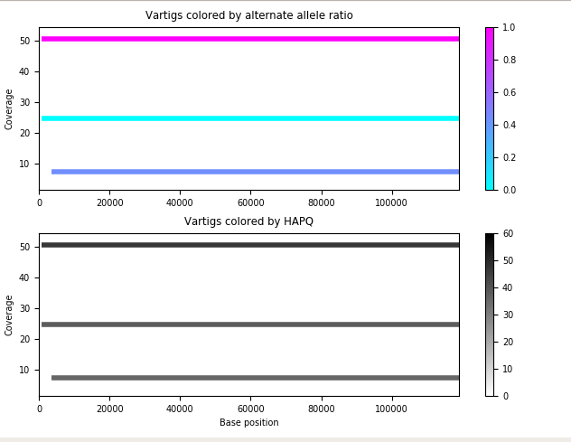
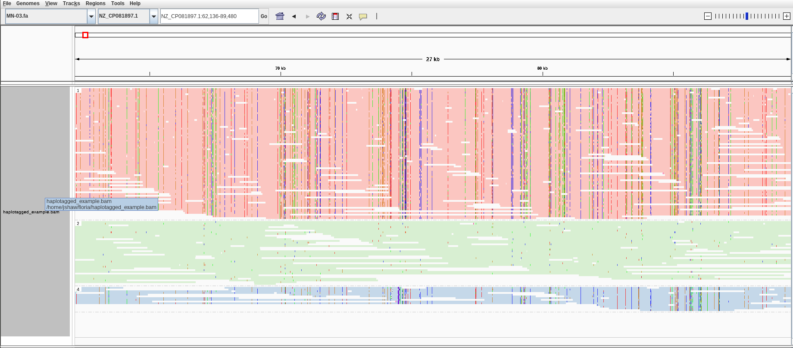
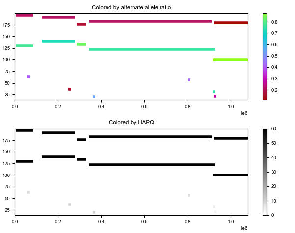
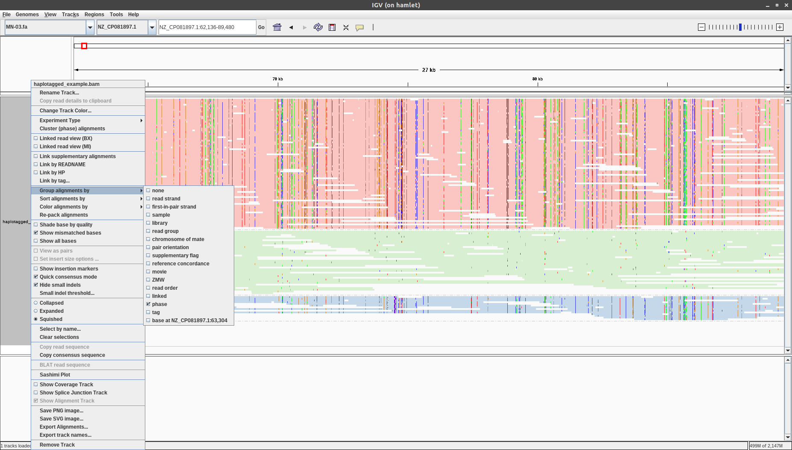

Tutorial 1: running floria and visualizing its outputs
================================================

This minimal tutorial goes over floria's inputs and outputs by running floria on toy data. We will show how to visualize and interpret floria's outputs. 

Prerequisites and running floria
^^^^^^^^^^^^

We will assume that you've installed floria and took a look through :doc:`../introduction`. See the :doc:`../quick_start` page if you have not installed floria. Once floria is installed, run the following commands.

.. code-block:: sh

   # clone the repository if you have not done so
   git clone https://github.com/bluenote-1577/floria
   cd floria

   # assuming you've installed floria
   floria -b tests/test_long.bam -v tests/test.vcf -r tests/MN-03.fa -o example_output
   ls example_output

For visualization, you will need:

#. `IGV <https://software.broadinstitute.org/software/igv/>`_ installed. 
#. matplotlib, numpy, python3 installed for vartig visualization.
#. samtools in PATH and pysam installed for IGV visualization. 

Running ``pip install pysam numpy matplotlib`` should do the trick if you don't have these dependencies installed. samtools can easily be installed via ``conda`` or built manually, but make sure it is in PATH if you want to do IGV visualization. 

Inputs
^^^^^

The provided files represent **a mixture of synthetic Klebsiella Pneumoniae reads** for **three different strains**. 

``test_long.bam`` represent **synthetic nanopore reads** from three different strains at 70x, 30x, and 10x coverage. We then mapped these reads to the ``MN-03.fa`` reference genome to generate the bam file. We only retained reads between positions 1-120,000 for this example. 

``test.vcf`` was obtained by calling SNPs on ``test_long.bam``. We used longshot, a long-read SNP caller to call these SNPs. 

``MN-03.fa`` is the contig we mapped onto. This is an arbitrary Klebsiella Pneumoniae strain.

Output log
^^^^^^^^^

Depending on your version of floria, you should see something like the following after running the command. 

.. code-block:: sh

    2023-06-12T23:33:40.561Z INFO  [floria::file_reader] 33,50,66 non-hard clipped read length percentiles: 9943, 13066, 16494. If -l is not set, estimated -l is set to 16494.
    2023-06-12T23:33:40.561Z INFO  [floria::file_reader] If -e is not set, estimated -e is set to 0.04081632653061224.
    2023-06-12T23:33:40.563Z INFO  [floria] Preprocessing VCF/Reference
    2023-06-12T23:33:40.568Z INFO  [floria] Finished preprocessing in 5.20466ms
    2023-06-12T23:33:40.568Z INFO  [floria] Reading and realigning inputs for contig NZ_CP081897.1 (BAM/VCF).
    2023-06-12T23:33:40.664Z INFO  [floria] Contig NZ_CP081897.1 has 954 SNPs
    2023-06-12T23:33:40.664Z INFO  [floria] Reading inputs, realigning time taken 96.312178ms
    2023-06-12T23:33:40.664Z INFO  [floria] Local phasing with 20 threads...
    2023-06-12T23:33:41.041Z INFO  [floria] Phasing time taken 376.723842ms
    2023-06-12T23:33:41.041Z INFO  [floria] Solving flow problem...
    2023-06-12T23:33:41.041Z INFO  [floria] Flow solved in time 339.672µs
    2023-06-12T23:33:41.084Z INFO  [floria::file_writer] Final SNP error rate for all haplogroups is 0.05546256145299258
    2023-06-12T23:33:41.085Z INFO  [floria] Total time taken is 522.39064ms

The "Total time ..." line indicates floria has exited successfully. A few lines that may be of interest:

#. The first line indicates what the ``-l`` parameter, the block length. See 
#. The second line indicates how we estimate the ``-e`` parameter, the baseline error rate. The user can also supply this. 
#. The line "Final SNP error rate ..." describes the fraction of alleles that are discordant in your final outputs. 

For understanding the ``-l`` and ``-e`` parameters, see :doc:`../how-to-guides/htg1`. 

floria's main outputs
^^^^^^^^^^^^^^^^^^^^^

The output structure is outlined in :ref:`usage-outputs` in detail, and a more detailed description of each output file is also in the link. Let's go over the important files. 

contig_ploidy_info.tsv
********************

.. code-block:: sh
    
    cat example_output/contig_ploidy_info.tsv

    contig	average_local_ploidy	average_global_ploidy	approximate_coverage_ignoring_indels	total_vartig_bases_covered	average_local_ploidy_min1hapq	average_global_ploidy_min1hapq  avg_err
    NZ_CP081897.1	3.000	3.000	79.601	354838	2.984	2.984   0.055

This file gives information about how many strains appear to be present in our sample. For each contig, a line with information will be present in this file. We only have one contig, so we only get one (non-header) line. 

The most important columns is the ``average_global_ploidy`` line, which gives a suggestion of how many strains there are. In our case, it looks like there are exactly 3 strains present, which is correct. 

As a sanity check, the ``total_vartig_bases_covered`` column gives 354838 bases, which is approximately 3 (the number of strains) times 120,000. Recall that we restricted our reads to lie within 1-120,000 along the contig. We'll see explain what a "vartig" is below. 

NZ_CP081897.1.haplosets
**********************

For the rest of the files, they are stored in ``example_output/NZ_CP081897.1``. floria outputs results for each individual contig in the bam file. Because we only have one contig, there is only one output folder. Let's start with the ``NZ_CP081897.1.haplosets`` file. 

The ``*.haplosets`` file is present for every contig phased. This describes the strain-level read clusters output by floria. 

.. code-block:: sh

    > head example_output/NZ_CP081897.1/NZ_CP081897.1.haplosets
    ------------------------------------------------------------
    >HAP0.example_output/NZ_CP081897.1	CONTIG:NZ_CP081897.1	SNPRANGE:1-15	BASERANGE:771-3416	COV:2.429	ERR:0.088	HAPQ:0	REL_ERR:1.591
    nc1_20364	2	12
    nc1_5047	3	15
    nc1_13853	3	14
    >HAP1.example_output/NZ_CP081897.1	CONTIG:NZ_CP081897.1	SNPRANGE:1-954	BASERANGE:771-119079	COV:49.374	ERR:0.075	HAPQ:47	REL_ERR:1.346
    nc1_929	1	110
    nc1_30767	1	59
    nc1_35492	1	35
    nc1_16553	1	26
    nc1_35227	2	71
    ...

The first line with the ``>`` gives information about the haploset. Again, all of the flags are described in :ref:`usage-outputs`, but let's go over the important ones. 

#. The first haploset is called ``HAP0``, and it covers the SNPs through [1,15] (inclusive interval).
#. The bases it covers are [771,3416], which corresponds to SNPs [1,15].
#. The ``COV`` is 2.429, so it is does not have high coverage. 
#. The ``HAPQ`` is 0. 

The rest of the lines indicate which reads are contained in the haploset, and what SNP positions each read covers. The first read covers [2,12], for example. 

Interpreting the haploset information
***********************************

It looks like the first haploset is a small set containing only 3 long-reads, and not covering much of the genome. The low ``HAPQ`` is indicative that this phasing may be spurious. **HAPQ does not indicate if the phasing is good, just whether or not it may be spurious**. 

#. By "spurious", we mean "Does this phasing really represent the existence of a strain?"
#. By "good" we mean, "Are there errors in this phasing? e.g. are there switch errors?"

.. note::

    Switch errors are a specific type of common error that occurs in haplotype phasing. 

The technical details of how HAPQ is actually calculated means that it represents only the first interptation, not the second. So our HAPQ is 0; is this fair? Well, it turns out our reads have prefixes which indicate what strain they really came from (because we simulated our reads). As can be seen below:

.. code-block:: sh

    > cat example_output/NZ_CP081897.1/NZ_CP081897.1.haplosets
    ------------------------------------------------------------
    >HAP0.example_output/NZ_CP081897.1	CONTIG:NZ_CP081897.1	SNPRANGE:1-15	BASERANGE:771-3416	COV:2.429	ERR:0.088	HAPQ:0	REL_ERR:1.591
    nc1_20364	2	12
    nc1_5047	3	15
    nc1_13853	3	14
    >HAP1.example_output/NZ_CP081897.1	CONTIG:NZ_CP081897.1	SNPRANGE:1-954	BASERANGE:771-119079	COV:49.374	ERR:0.075	HAPQ:47	REL_ERR:1.346
    nc1_929	1	110
    nc1_30767	1	59
    nc1_35492	1	35
    nc1_16553	1	26
    nc1_35227	2	71
    ...
    >HAP2.example_output/NZ_CP081897.1      CONTIG:NZ_CP081897.1    SNPRANGE:1-954  BASERANGE:771-119079    COV:23.742      ERR:0.019       HAPQ:38 REL_ERR:0.349
    mn1_15098       1       16
    mn1_2680        3       75
    mn1_15393       3       48
    mn1_14763       3       39
    mn1_8191        3       26
    ...
    >HAP4.example_output/NZ_CP081897.1      CONTIG:NZ_CP081897.1    SNPRANGE:16-954 BASERANGE:3502-119079   COV:6.549       ERR:0.041       HAPQ:36 REL_ERR:0.744
    pa1_5458        21      73
    nc1_10985       22      23
    nc1_35501       23      23
    pa1_2856        24      111
    pa1_272 33      202
    pa1_3056        33      46
    pa1_344 46      56
    pa1_983 47      131
    pa1_1945        53      251
    pa1_127 53      75
    pa1_2033        59      136
    pa1_4379        67      73
    ...

It turns out that ``HAP0`` is really a false haplotype after looking at this file in more detail. 

#. ``HAP1`` is a much longer version of ``HAP0``, capturing the ``nc1`` strain. 
#. ``HAP2`` captures the ``mn1`` strain.
#.  ``HAP4`` (notice the skip; haplotype numbering can skip) captures the ``pa1`` strain, although some short ``nc1`` reads are mixed in. 

so it's good we assumed 0 to the HAPQ. 

NZ_CP081897.1.vartigs
**********************

Often we don't care about the exact reads in the haploset, but what sequence of alleles are present on the haplotype represented by the haploset. We will call these **vartigs**, which are analogous to contigs but on the variant (SNP) level, not on the base level. This is found in the ``example_output/NZ_CP081897.1/NZ_CP081897.1.vartigs`` file. 

.. code-block:: sh

    cat example_output/NZ_CP081897.1/NZ_CP081897.1.vartigs
    ------------------------------------------------------
    >HAP0.example_output/NZ_CP081897.1	CONTIG:NZ_CP081897.1	SNPRANGE:1-15	BASERANGE:771-3416	COV:2.429	ERR:0.088	HAPQ:0	REL_ERR:1.591
    ?11111111111111
    >HAP1.example_output/NZ_CP081897.1	CONTIG:NZ_CP081897.1	SNPRANGE:1-954	BASERANGE:771-119079	COV:49.374	ERR:0.075	HAPQ:47	REL_ERR:1.346
    11111111111111111111111111111111111111...
    >HAP2.example_output/NZ_CP081897.1	CONTIG:NZ_CP081897.1	SNPRANGE:1-954	BASERANGE:771-119079	COV:23.742	ERR:0.019	HAPQ:38	REL_ERR:0.349
    00000000000000000000000000000000000000...
    >HAP4.example_output/NZ_CP081897.1	CONTIG:NZ_CP081897.1	SNPRANGE:16-954	BASERANGE:3502-119079	COV:6.549	ERR:0.041	HAPQ:36	REL_ERR:0.744
    ?????011000010101010101011110010011111...

The header info in the vartig file is in the same format. However, instead of representing groups of reads, the vartig gives the sequence of SNPs in the haplosets. 

#. The allele ``0`` represents the reference allele. 
#. The allele ``1`` represents the first alternate allele. ``2`` would represent the second, and so forth. 
#. The allele ``?`` represents no reads in that haploset cover the allele, so it is unknown. 

We truncated the vartigs in the above output, but HAP1 has almost all alleles ``1`` in the range [1,954], whereas HAP2 has ``0`` on almost all alleles. HAP4 is a mix of ``0`` and ``1``. This makes sense; it turns out **we took reads from the reference genome MN-03.fa for the strains captured by HAP2**, so it makes sense that HAP2 is almost all reference (any ``1`` alleles for HAP2 would be errors). 

.. note::

    Notice that the ERR for the vartigs increase as the number of alternate alleles increase. This is called **reference bias**; SNP calls are biased towards the reference, so true alternate alleles are called less often. 

reads_without_snps.tsv
********************

This file captures any reads that do not have SNPs present (e.g. reads that are too short) or are placed in regions without any SNPs. In our example, there are SNPs throughout the genome, so this file is empty. 

vartig_info/hap*.txt
****************************

For more information about the haplosets/vartigs, look at the files in ``example_output/NZ_CP081897.1/vartig_info/*``. These files give more information about how confident we are in each allele call for each vartig. See :ref:`usage-outputs`.

Outputting reads
***************

By default, floria only outputs read ids for the phased haplosets. If you want the base-level reads, use the ``--output-reads`` option. If you look at ``example_output/NZ_CP081897.1/long_reads``, you'll see the folder is empty, but we can rerun floria:

.. code-block:: sh

   # need to specify --ovewrite and --output-reads
   floria --overwrite --output-reads -b tests/test_long.bam -v tests/test.vcf -r tests/MN-03.fa -o example_output

and now the reads appear like ``example_output/NZ_CP081897.1/long_reads/2_part.txt``. These are the reads corresponding to HAP2. Importantly, these reads are **trimmed** against the haploset and may not represent the original reads. See :ref:`read-outputs` for more information. 

Visualizing vartigs/haplosets
^^^^^^^^^^^^^^^^^^^^^^^^^^^^

To visualize your vartigs, we provide a script called ``visualize_vartigs.py`` in the following repository: https://github.com/bluenote-1577/vartig-utils. You will need numpy and matplotlib installed. Simply run:

.. code-block:: sh

    git clone https://github.com/bluenote-1577/vartig-utils
    python vartig-utils/visualize_vartigs.py

You should see the above figure. In a nutshell:

#. Each bar represents a vartig with HAPQ > 0. 
#. The y-axis represents the COV for the vartig, and the x-axis represents the BASERANGE of the vartig.
#. The upper plot colors the vartig by alternate allele fraction. That is, what precentage of the vartig contains non ``0`` alleles. 
#. The lower plot colors the vartig by HAPQ. 

 We have three true strains here, which are well represented by this plot. 

 We've found the above visualization to be very useful in practice for confirming that a phasing is reasonable. If you have a consistent coverage level and alternate allele fraction, you can be confident that your phasing is reasonable. For example, the second picture is a phasing for a **real** nanopore community with a slightly different colormap:

Notice that alternate allele fraction is relatively constant and that coverage is consistent, even across broken vartigs. 

Visualizing haplosets via IGV
^^^^^^^^^^^^^^^^^^^^^^^^^^^^

To visualize the actual reads in the haplosets instead of just the vartig, we provide the script ``floria/scripts/haplotag_dir.py``. This script outputs a bam file with **haplotagging information**, a field in the BAM record that indicates which phasing a read comes from. 

.. code-block:: sh

    python scripts/haplotag_output_dir.py -d example_output/ -b tests/test_long.bam -o haplotagged_example 
    ls haplotagged_example.bam haplotagged_example.bam.bai

For more in-depth information on how to use the IGV, see any tutorial out there. Briefly, once you have the IGV open, simply

#. Load the ``haplotagged_example.bam`` file and ``MN-03.fa`` as the reference.
#. Right click the left panel, click "Group alignments by" and then "phase". 
#. Right click the left panel, and choose "squished". 

You should then see the following picture. 

The HAP number are shown on the left hand side. 
